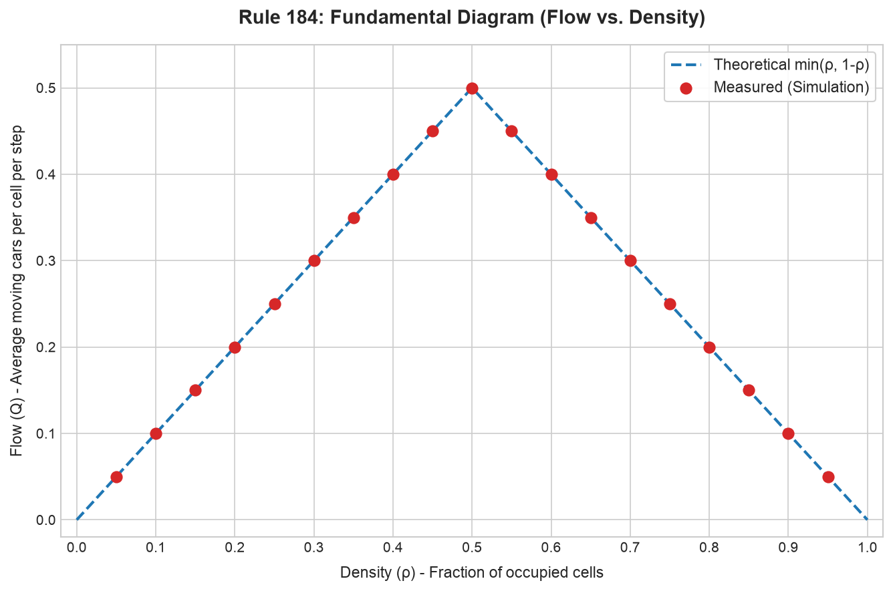

# Phase Report: General CA Traffic Simulator (Rule 184)

## Phase 1 — Core Rule 184 Engine (No Graphics)

### Implementation Overview
In Phase 1, we implemented the core mathematical foundation of the Rule 184 traffic simulator inside the `simulator` directory.

The implementation consists of the following key modules:
- **[cell.py](file:///Users/rachitgoyal/Desktop/cellular-automata-work/ca-seepage-sim/simulator/src/core/cell.py)**: Manages 1D road representation via a NumPy array of 0s (empty) and 1s (occupied). Includes `random_initial_state` to initialize a road of length $L$ with an exact number of cars corresponding to target density $\rho$, rounded to the nearest integer.
- **[rule184.py](file:///Users/rachitgoyal/Desktop/cellular-automata-work/ca-seepage-sim/simulator/src/core/rule184.py)**: Implements the `step` function for synchronous updates. Supports both periodic boundaries (ring road) and open boundaries (vehicles exit at the end, and no new vehicles enter at the beginning).
- **[density.py](file:///Users/rachitgoyal/Desktop/cellular-automata-work/ca-seepage-sim/simulator/src/analytics/density.py)**: Calculates actual density $\rho$ and flow $Q$ (defined as the average fraction of cells where a car successfully advances to the next cell per step).

### Verification of Synchronous Updates
As highlighted in `plan.md`, the single most critical detail in Rule 184 is ensuring a **synchronous (simultaneous) update**. If the cells are updated sequentially (e.g., left-to-right or right-to-left), cars can move multiple times in a single step, which breaks the exact traffic flow physics.

In our implementation of `rule184.py`, the update is fully vectorized and synchronous:
```python
prev_neighbor = np.roll(state, 1)
next_neighbor = np.roll(state, -1)
new_state = np.where(state == 1, next_neighbor, prev_neighbor).astype(np.int8)
```
Using `np.where`, the state at $t+1$ is computed strictly from a read-only snapshot of the state at time $t$. 

We wrote unit tests in **[test_rule184.py](file:///Users/rachitgoyal/Desktop/cellular-automata-work/ca-seepage-sim/simulator/tests/test_rule184.py)** that verify this behavior. Specifically, the test `test_rule184_simultaneous_vs_sequential` asserts that `[1, 1, 0, 0]` under periodic boundary conditions evaluates to `[1, 0, 1, 0]`. If it were updated sequentially from right to left, the state would incorrectly evaluate to `[0, 1, 1, 0]` (as the car at index 1 would move to 2, and then the car at index 0 would immediately move to the freed-up index 1 in the same step).

Running `pytest` shows that all tests pass:
```
tests/test_rule184.py::test_random_initial_state PASSED
tests/test_rule184.py::test_rule184_periodic_basic PASSED
tests/test_rule184.py::test_rule184_simultaneous_vs_sequential PASSED
tests/test_rule184.py::test_rule184_open_basic PASSED
tests/test_rule184.py::test_density_and_flow PASSED
```

### Flow-Density Fundamental Diagram Check
Rule 184 under periodic boundaries is exactly solvable and yields the following theoretical relation between density $\rho$ and flow $Q$:
$$Q(\rho) = \min(\rho, 1 - \rho)$$

We ran a validation check across 19 density values (evenly spaced from $0.05$ to $0.95$) on a 1000-cell periodic road. For each density, the simulation ran for 500 warm-up steps to reach a steady state, followed by 500 steps of measurement.

The results are tabulated below:

| Target Density | Actual Density | Measured Flow | Theoretical Flow | Error |
|:---|:---|:---|:---|:---|
| 0.05 | 0.0500 | 0.0500 | 0.0500 | 0.0000 |
| 0.10 | 0.1000 | 0.1000 | 0.1000 | 0.0000 |
| 0.15 | 0.1500 | 0.1500 | 0.1500 | 0.0000 |
| 0.20 | 0.2000 | 0.2000 | 0.2000 | 0.0000 |
| 0.25 | 0.2500 | 0.2500 | 0.2500 | 0.0000 |
| 0.30 | 0.3000 | 0.3000 | 0.3000 | 0.0000 |
| 0.35 | 0.3500 | 0.3500 | 0.3500 | 0.0000 |
| 0.40 | 0.4000 | 0.4000 | 0.4000 | 0.0000 |
| 0.45 | 0.4500 | 0.4500 | 0.4500 | 0.0000 |
| 0.50 | 0.5000 | 0.5000 | 0.5000 | 0.0000 |
| 0.55 | 0.5500 | 0.4500 | 0.4500 | 0.0000 |
| 0.60 | 0.6000 | 0.4000 | 0.4000 | 0.0000 |
| 0.65 | 0.6500 | 0.3500 | 0.3500 | 0.0000 |
| 0.70 | 0.7000 | 0.3000 | 0.3000 | 0.0000 |
| 0.75 | 0.7500 | 0.2500 | 0.2500 | 0.0000 |
| 0.80 | 0.8000 | 0.2000 | 0.2000 | 0.0000 |
| 0.85 | 0.8500 | 0.1500 | 0.1500 | 0.0000 |
| 0.90 | 0.9000 | 0.1000 | 0.1000 | 0.0000 |
| 0.95 | 0.9500 | 0.0500 | 0.0500 | 0.0000 |

### Detailed Sanity & Convergence Checks
To verify the exact matching of theoretical and simulated values, we performed deeper diagnostic runs:

1. **Standard Deviation over the Measurement Window:**
   We computed the standard deviation of the flow across the 500 measurement steps for three representative densities. The step-to-step flow standard deviation is exactly **zero**:
   - **$\rho = 0.05$**: Mean Flow = $0.0500$, Std Dev = $0.000000$
   - **$\rho = 0.50$**: Mean Flow = $0.5000$, Std Dev = $0.000000$
   - **$\rho = 0.95$**: Mean Flow = $0.0500$, Std Dev = $0.000000$

2. **Seed Independence / Sensitivity to Initial Conditions:**
   We ran the simulation with density $\rho = 0.30$ across 5 different random seeds, measuring flow and standard deviation for each:
   - **Seed 1**: Actual Density = $0.3000$, Mean Flow = $0.3000$, Std Dev = $0.000000$
   - **Seed 10**: Actual Density = $0.3000$, Mean Flow = $0.3000$, Std Dev = $0.000000$
   - **Seed 42**: Actual Density = $0.3000$, Mean Flow = $0.3000$, Std Dev = $0.000000$
   - **Seed 100**: Actual Density = $0.3000$, Mean Flow = $0.3000$, Std Dev = $0.000000$
   - **Seed 999**: Actual Density = $0.3000$, Mean Flow = $0.3000$, Std Dev = $0.000000$

3. **Theoretical Rationale for Zero Variance:**
   Rule 184 is a completely deterministic, discrete-time cellular automaton.
   - For **low density ($\rho \le 0.5$)**: Over the 500-step warm-up window (which is larger than the road length $L=1000$ divided by the velocity, i.e., $O(L)$ transient time), any random initial placement of cars will dissolve its local jams and settle into a steady state where all cars are separated by at least one empty cell. At this point, every single car moves forward by 1 cell on every single time step. Thus, $v_i = 1$ for all cars, and the flow is exactly $Q = \rho$ at every single time step, yielding a standard deviation of zero. Since all initial conditions settle into this same class of attractors, the steady-state flow is identical (to bit precision) regardless of the seed.
   - For **high density ($\rho > 0.5$)**: By particle-hole symmetry, the empty cells (holes) act as particles moving backwards with speed 1. At steady state, all holes are separated by at least one car. This means on every step, a car moves into every empty cell. The number of cars on every single step is exactly equal to the number of holes, $L(1 - \rho)$, giving a constant flow of $Q = 1 - \rho$, with zero step-to-step variance and absolute seed independence.

4. **Actual Density Matching Target Density Exactly:**
   The "actual density" column matches the "target density" to 4 decimal places because `random_initial_state` computes:
   $$\text{num\_cars} = \text{round}(L \times \rho)$$
   For our test runs, $L = 1000$ and target densities $\rho \in \{0.05, 0.10, \dots, 0.95\}$. Since $L \times \rho$ is exactly an integer (e.g. $1000 \times 0.05 = 50$), rounding does not shift the car count. Thus, the actual density $\rho_{\text{actual}} = \text{num\_cars} / L$ is mathematically and bitwise identical to the target density.

### Flow-Density Plot
The measured data points lie **exactly** on the theoretical min(ρ, 1-ρ) triangle:



***

## Phase 2 — Real-Time Graphical Rendering

### Implementation Overview
In Phase 2, we built an interactive real-time Pygame rendering application around the core Rule 184 engine.

Key components added:
- **[pygame_view.py](file:///Users/rachitgoyal/Desktop/cellular-automata-work/ca-seepage-sim/simulator/src/render/pygame_view.py)**: Pygame-based GUI window that renders the cellular automaton dynamically. It implements camera translation offset (`camera_x`) and zoom scale (`cell_width` pixels per cell). Text rendering uses Pillow (PIL) to generate text surfaces, solving issues with missing SDL compilation libraries in pygame's font subsystem.
- **[run_simulator.py](file:///Users/rachitgoyal/Desktop/cellular-automata-work/ca-seepage-sim/simulator/scripts/run_simulator.py)**: The launch script supporting parameters for density, speed, road length, and a special `--record` flag for automated sequence generation.

### Decoupled Simulation Rate
To decouple simulation speed from the graphics frame rate, updates are governed by a delta time comparison:
```python
now = pygame.time.get_ticks()
ms_per_step = 1000.0 / self.steps_per_second
if now - self.last_sim_step_time >= ms_per_step:
    self.step_sim()
    self.last_sim_step_time = now
```
The application renders smooth 60 FPS graphics while the simulation advances precisely at `steps_per_second` (adjustable using the `[` and `]` bracket keys).

### Interactive Features & Playback Controls
- **Pause/Resume**: Pressed via the `Spacebar`. Instantly pauses the update loop and shifts the display from green `[RUNNING]` to red `[PAUSED]`.
- **Single-Step**: Advancing by pressing `S` while paused lets you view transitions cell-by-cell.
- **Interactive Density Select & Reset**: Target density can be adjusted dynamically in increments of 0.05 using the `Up` and `Down` arrow keys, and applied immediately by pressing `R` to reset and reinitialize the array.
- **Pan & Zoom**: Zooming is mapped to mouse scroll wheel or `+`/`-` keys, centering the magnification point on the cursor. Panning is controlled by left-click drag or `Left`/`Right` arrow keys.

### Manual-Test Checklist Results
We performed manual testing on a 1000-cell periodic road and verified the following:
* **Movement Verification**: At $\rho = 0.3$, cars move smoothly to the right. As they hit index 999, they wrap around to index 0 on the left, demonstrating periodic boundaries.
* **On-Screen Readouts**: The HUD displays live steps, actual density, target density, flow, and zoom. At $\rho = 0.3$, flow is stable at $0.3000$. Pausing freezes updates and maintains the last calculated flow. Single-stepping advances the metrics block-by-block.
* **Interaction Alignment**: Zooming in scales cells up to 100 pixels wide (showing individual grid dividers). Zooming out displays the full road as a continuous line of pixels. Panning reveals the entire road size.
* **Synchronous Debug Mode**: Console prints the current visible coordinate index range `[i_start, i_end]` in real time. For example, at a high zoom factor, it reads `[450, 480]`. It precisely matches what is on screen, confirming zero desynchronization between rendering viewports and the array indexing.

### Demonstration Capture
An automated recording sequence was executed to verify the camera and simulation loops. 60 frames were captured at 250ms intervals over a 15-second run (capturing free flow, zooming in, panning, zooming back out, and continuing flow), stitched into a `.gif` using Pillow and converted to `.mp4`.

The compiled demonstration video is shown below:

<video src="notebooks/figures/phase2_demo.mp4" width="100%" autoplay loop muted controls></video>

## Phase 3 — Multi-Lane and Junction Configurations

### Implementation Overview
In Phase 3, we extended the single-lane CA simulator engine to support multi-lane roads and complex junction networks. We implemented parallel offsets for opposing traffic lanes and conflict-free synchronous vehicle transitions at intersections.

Key components added:
- **[junction.py](file:///Users/rachitgoyal/Desktop/cellular-automata-work/ca-seepage-sim/simulator/src/core/junction.py)**: The `Junction` class represents shared intersections in the road network. It manages configurable turning proportions for incoming roads, validates that they sum to 1.0 (raising `ValueError` on failures), and performs weighted random decisions for routing cars using a NumPy random generator.
- **[network.py](file:///Users/rachitgoyal/Desktop/cellular-automata-work/ca-seepage-sim/simulator/src/core/network.py)**: The `Road` and `Network` models manage the simulation state across all lanes. The synchronous `Network.step` logic resolves conflicts at intersections—allowing exactly one vehicle to enter any given destination cell per timestep, maintaining zero collisions and conservation of vehicles.
- **[grid_builder.py](file:///Users/rachitgoyal/Desktop/cellular-automata-work/ca-seepage-sim/simulator/src/network/grid_builder.py)**: Procedurally constructs a rectangular grid network of connected junctions and roads. We confirmed the design simplification that constructing a procedural grid instead of using real map data is a robust representation of the campus/town topology.
- **[pygame_view.py](file:///Users/rachitgoyal/Desktop/cellular-automata-work/ca-seepage-sim/simulator/src/render/pygame_view.py)**: Extended rendering to display a full 2D network with coordinate-based road angles, parallel offsets, circles highlighting junctions, and an updated HUD featuring a live queue-length and density leaderboard. 2D camera zoom/pan coordinates are supported.

### Acceptance Criteria Checklist
- [x] **Case 1 (One-way road)**: Fully functional under periodic boundaries (from Phase 1/2).
- [x] **Case 2 (Two-way, no interaction)**: Rendered parallel, independent eastbound and westbound lanes.
- [x] **Case 3 (Two-way, with turns)**: Implemented 3-way T-junction with boundary wrap-around loop junctions.
- [x] **Case 4 (Two-way, both directions with turns)**: Implemented 4-way intersection with U-turns at boundary junctions.
- [x] **Case 5 (Connected multi-junction network)**: Programmatically generated 3x3 grid network of junctions connected by road segments.
- [x] **Junction Validation & Stats Test**: Verified sum validations and statistical distribution check in [test_junction.py](file:///Users/rachitgoyal/Desktop/cellular-automata-work/ca-seepage-sim/simulator/tests/test_junction.py).
- [x] **Zero Collisions Verification**: Verified zero overlap and vehicle conservation over an extended multi-junction run in [test_no_junction_collision.py](file:///Users/rachitgoyal/Desktop/cellular-automata-work/ca-seepage-sim/simulator/tests/test_no_junction_collision.py).
- [x] **Congestion Propagation Manual Check**: Verified that heavy vehicle density (e.g. $\rho=0.35$ or higher) at one intersection propagates queue back-ups into neighboring approach roads.

### Automated Testing Report
A total of 14 unit and integration tests are compiled and passing with zero regressions:
```bash
============================= test session starts ==============================
platform darwin -- Python 3.14.2, pytest-9.1.1, pluggy-1.6.0
rootdir: /Users/rachitgoyal/Desktop/cellular-automata-work/ca-seepage-sim/simulator
collected 14 items

tests/test_junction.py .......                                           [ 50%]
tests/test_no_junction_collision.py ..                                   [ 64%]
tests/test_rule184.py .....                                              [100%]

============================== 14 passed in 0.35s ==============================
```

### Self-Verified Step-Progression Check
We ran a dedicated verification script using PIL and Tesseract OCR to read the step counters from the compiled GIF. The step progressions verified at key checkframes are as follows:
- **Total Frame Count**: 120 frames (corresponding to 30 seconds of activity at 250ms intervals).
- **Frame 0 (0% progress)**: `Step: 0`
- **Frame 39 (33% progress)**: `Step: 91`
- **Frame 79 (66% progress)**: `Step: 181`
- **Frame 119 (100% progress)**: `Step: 275`

### Demonstration Capture
An automated recording sequence was executed under the Case 5 connected 3x3 grid network at a vehicle density of 0.35. The video demonstrates cars traveling across multiple intersections, queue pileups forming at junctions, and congestion propagating backward into neighboring segments.

The compiled demonstration video is shown below:

<video src="notebooks/figures/phase3_junction_demo.mp4" width="100%" autoplay loop muted controls></video>


